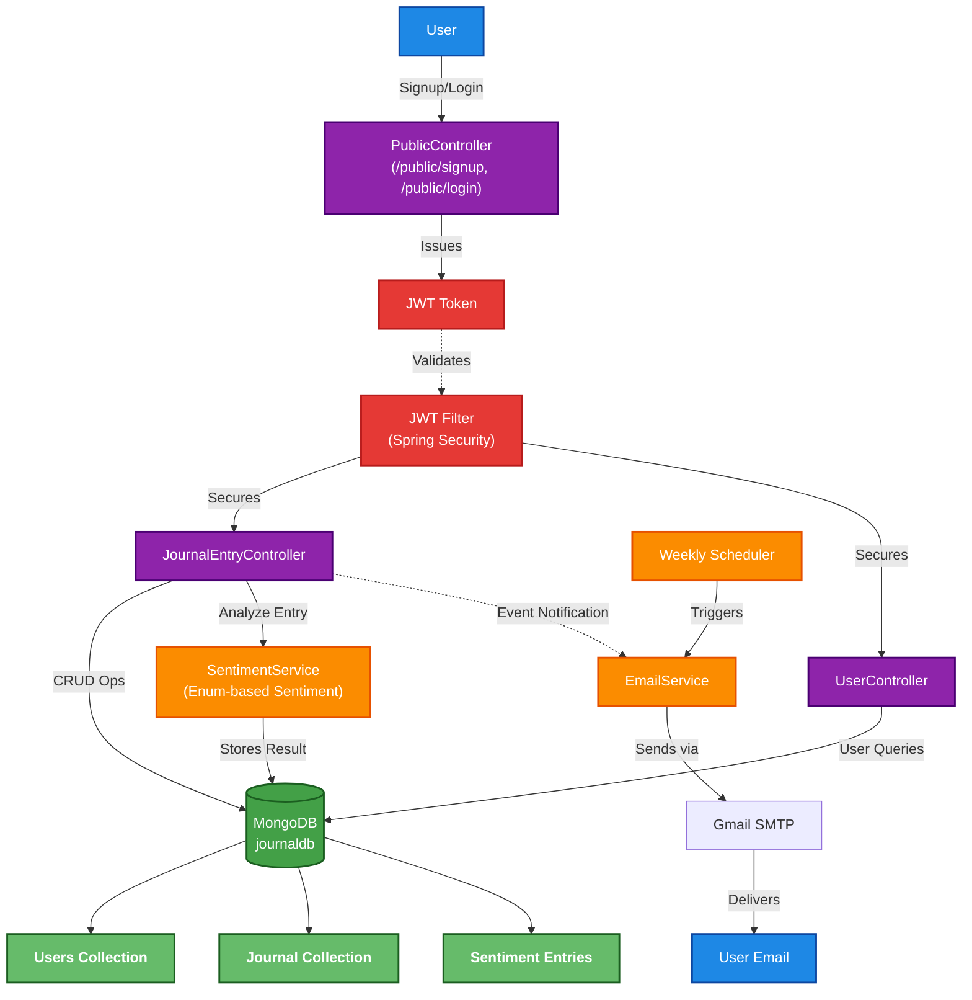

# Journal App

An E2EE journaling application built with **Spring Boot** and **MongoDB**, enabling users to create, view, update, and delete personal journal entries with authentication, sentiment analysis and email notifications.

---

## Features

* **RESTful API** endpoints for CRUD operations.
* **Secure authentication** using Spring Security with JWT.
* **MongoDB** for flexible, cloud-ready storage.
* **Sentiment analysis** on entries to gauge mood (custom logic, not external API).
* **Email notifications** (weekly sentiment summary).
* **Testing setup** with JUnit and Mockito.

---

## Tech Stack

* **Language & Framework**: Java, Spring Boot
* **Database**: MongoDB (Atlas)
* **Security**: Spring Security + JWT
* **Testing**: JUnit, Mockito
* **Notifications**: Gmail SMTP
* **Data Insights**: Sentiment analysis (custom enum)
* **Scheduling**: Spring's `@Scheduled`
* **Dev Tools**: Lombok, Maven, SonarLint/SonarQube

---

## Getting Started

### Installation Steps

1. **Clone the repository**

   ```bash
   git clone https://github.com/sathwikhbhat/journal-app.git
   cd journal-app
   ```

2. **Configure application properties**
   In `src/main/resources/application.yml`, set:

   ```yaml
   spring:
     data:
       mongodb:
         uri: <YOUR_MONGODB_URI>
     mail:
       username: <YOUR_GMAIL_ADDRESS>
       password: <YOUR_APP_PASSWORD>
   ```

3. **Build & Run**

   ```bash
   mvn clean install
   mvn spring-boot:run
   ```

   The API will be available at **`http://localhost:8080`**.

---

## Endpoints Overview

| Endpoint                   | Method | Description                              |
| --------------------------| ------ | ---------------------------------------- |
| `/public/signup`          | POST   | Register a new user                      |
| `/public/login`           | POST   | Obtain a JWT token                       |
| `/journalEntries`         | GET    | List all journal entries (auth required) |
| `/journalEntries`         | POST   | Create a new entry                       |
| `/journalEntries/id/{id}` | GET    | Retrieve a specific entry                |
| `/journalEntries/id/{id}` | PUT    | Update an entry                          |
| `/journalEntries/id/{id}` | DELETE | Remove an entry                          |
| `/user`                   | GET    | Get user data (auth required)            |
| `/user`                   | PUT    | Update user data                         |
| `/user`                   | DELETE | Delete user data                         |

---

## Usage Example

```http
POST /public/login
Content-Type: application/json

{
  "userName": "rohan",
  "password": "rohan123"
}
```

Receive a JWT token, then use it:

```http
GET /journalEntries
Authorization: Bearer <your_jwt>
```

---

## System Architecture
<details>
<summary>Click to expand</summary>


</details>

## Testing

Run your tests with:

```bash
mvn test
```
---

## Contributing

Contributions are welcome!

1. Fork the repo
2. Create a feature branch (`git checkout -b feature/…`)
3. Commit your changes
4. Open a pull request

Please follow the existing style rules and update unit tests where necessary.

---

## Credits

This project was built with guidance, feedback, and support from [@thevipulvats](https://github.com/thevipulvats).


---

## Contact

Created by **Sathwik Hejamady Bhat** 
